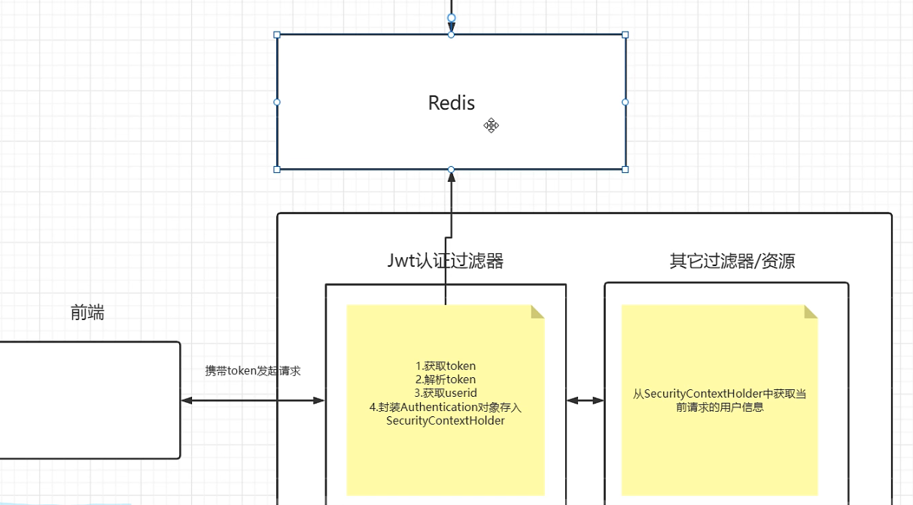

## Springsecurity

### 登录

> 根据username数据库查询用户实体

```java
//实现接口里面的public UserDetails loadUserByUsername(String username)方法
implements UserDetailsService{}
```

可以看出返回对象是一个UserDetails,它其实是一个接口,所以我们需要实现它然后返回其实现类

```java
//本质上还是返回用户对象
public class LoginUser implements UserDetails {
    private User user;
}
```

> 加密 我们用什么加密算法直接在config里面配置

```java

@Configuration
public class SecurityConfig extends WebSecurityConfigurerAdapter {
    /**
     * @Author lidian
     * @Date 2022/8/11
     * @Description Bcrypt就是一个用于密码加密的工具, 可以对一段文本进行加密和解密
     */
    @Bean
    public PasswordEncoder passwordEncoder() {
        return new BCryptPasswordEncoder();
    }
}
```

> #### 以上是零碎知识点,loginServiceimpl才是梦开始的地方
我们从前端获取user传过来的user,其实也就是一个用户名和密码 然后我们进行账号密码校验(使用到了加密是加密数据库中的数据,防止曝光),账号密码通过后给出jwt(用户id的加密) 也是一种形式的加密,相当于用户的一卡通

```java

@Service
public class loginserviceimpl implements loginService {
    @Autowired
    private AuthenticationManager manager;
    @Autowired
    private RedisCache redisCache;

    @Override
    public ResponseResult login(User user) {
//        进行用户认证
        UsernamePasswordAuthenticationToken authenticationToken = new UsernamePasswordAuthenticationToken(user.getUserName(), user.getPassword());
        // 用户认证其实也就是校验账号面面是否匹配,框架自动调用UserDatailServiceImpl里面的实现
        Authentication authenticate = manager.authenticate(authenticationToken);
//        认证没通过 提示
        if (authenticate == null) {
            throw new RuntimeException("登录失败");
        }
//        通过给出随机jwt
        LoginUser loginUser = (LoginUser) authenticate.getPrincipal();
        Long id = loginUser.getUser().getId();
        String jwt = JwtUtil.createJWT(id.toString());
        HashMap<String, String> map = new HashMap<>();
        map.put("token", jwt);
//        把用户完整信息存入reds,uid作为key,实体作为value;
        redisCache.setCacheObject("login" + id, loginUser);
        return new ResponseResult(200, "登录成功", map);
    }
}
```

### 校验

定义JWT认证过滤器

* 获取token
* 解析token 获取userid
* 从redis获取用户信息
* 存入securitycontextholder
    * 这里必须要存入hodler中，因为我们过滤器不止一个,如果hodler中找不到你相关的认证信息,过滤器会默认将你拦截

---
不是很懂经历了什么,大体上好像配置了一个过滤器,然后再config里面添加了过滤器,实现

- 登录页面,不需要携带token,只需用户名和密码
- 其他页面需要在请求header里面携带token（userid的jwt加密）,可以访问,否则拦截


用户登录成功意味着 SecurityHoder中已经有用户认证相关信息了,用户发送其他请求(非登录),需要携带token 才能访问 用户注销功能就是 清除redis里面相关用户的缓存以及删除Sercurityhoder里面用户认证信息
> logout 重点删redis缓存信息,不需要参数,只需要header携带token告诉我删除哪一个,删除完以后即使携带token访问请求也不响应了
